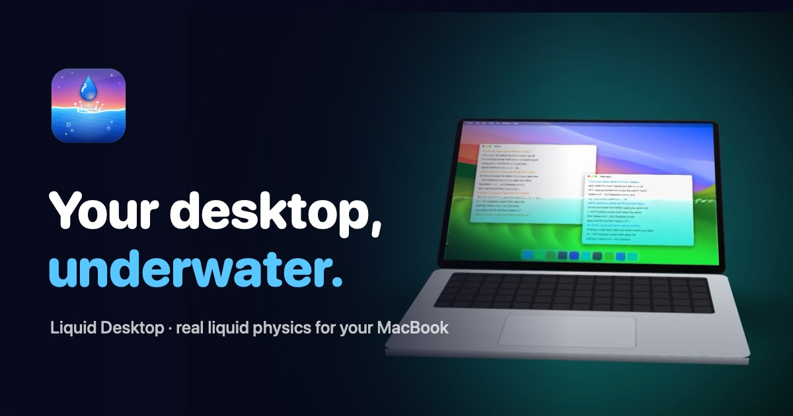

# Liquid Desktop

Liquid Desktop turns your Mac desktop into a living layer of water. Tilt the
lid and the fluid follows. Rock it and the surface ripples, refracts the screen,
and splashes in real time.

Built natively for macOS with Swift, Metal, ScreenCaptureKit, and SwiftUI.



**Live website:** [liquid-desktop-bgj.pages.dev](https://liquid-desktop-bgj.pages.dev/)

## Highlights

- Real-time fluid simulation driven by MacBook lid angle and pointer movement
- Screen refraction rendered locally on the GPU
- Clear water, lagoon, mercury, and lava themes
- Menu bar controls, global hotkeys, and adjustable water amount
- No accounts, analytics, tracking, or network-based screen capture
- Universal macOS build for Apple silicon and Intel

## Repository layout

| Path | Purpose |
| --- | --- |
| `Sources/LiquidDesktop/` | Native macOS application source |
| `Tools/` | Preview, icon, mockup, and promotional render tools |
| `Resources/` | App bundle metadata, entitlements, and icon assets |
| `site/` | Static product website and its media assets |
| `marketing/` | Launch copy and export-ready promotional videos |
| `wrangler.jsonc` | Cloudflare Workers static-assets deployment config |

## Build the macOS app

The project uses the macOS Command Line Tools and does not require an Xcode
project or Swift Package Manager.

```bash
make
make install
```

For a local preview render:

```bash
make preview THEME=lagoon
```

The distributable DMG is created with:

```bash
make dmg
```

The default local signing identity is intended for development. Distribution
requires a valid Apple Developer ID and notarization profile; see
[`marketing/LAUNCH.md`](marketing/LAUNCH.md).

## Web platform

The website is a dependency-free static site. Preview it locally from the
repository root:

```bash
python3 -m http.server 8080 --directory site
```

Deploy it to Cloudflare Workers with Wrangler:

```bash
npx wrangler login
npx wrangler deploy
```

The deploy uses `wrangler.jsonc` and publishes `site/` as Workers static
assets. The live website is designed to work without JavaScript frameworks or a
build step.

The current Cloudflare Pages deployment is available at
[liquid-desktop-bgj.pages.dev](https://liquid-desktop-bgj.pages.dev/).

## Website motion system

The web experience uses motion to demonstrate the product rather than decorate
the page:

| Animation | Implementation | Purpose |
| --- | --- | --- |
| Hero liquid loop | Autoplaying, muted `hero.mp4` | Shows the core fluid effect immediately |
| Sticky controller sequence | Sticky media plus active beat observer | Connects scroll position to the product story |
| Scroll reveals | `IntersectionObserver` and `.reveal.in` | Brings sections into view with restrained movement |
| Lazy video playback | `data-lazy` observer | Loads theme and reel videos only near the viewport |
| Liquid gallery | Horizontal scroll snap and smooth arrow controls | Lets visitors compare themes naturally |
| Battery meter | `.tile-battery.in` transition | Demonstrates the lightweight background behavior |
| Reduced motion mode | `prefers-reduced-motion` media query | Keeps the experience accessible |

The visual assets used in the website are available in
[`site/assets/`](site/assets/). The exported marketing videos are in
[`marketing/`](marketing/).

## Privacy

Liquid Desktop processes screen frames on the Mac and discards them after
rendering. The app does not transmit screen content or personal data. Read the
full website policy in [`site/privacy.html`](site/privacy.html).

## License

All rights reserved. This repository is published for project distribution,
review, and demonstration. The application, media, and brand assets may not be
redistributed without permission.